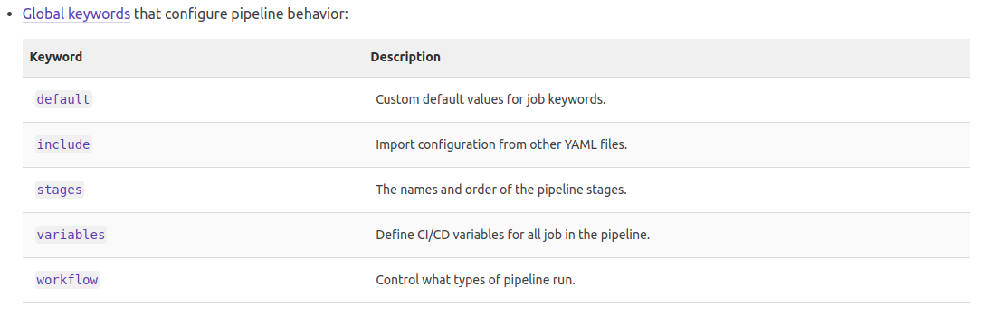
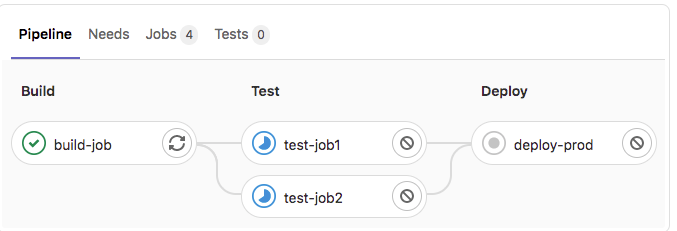

## 1. Các khái niệm trong GitLab CI/CD 
| Khái niệm  | Mô tả |
| ------------- | ---------------------------------------------|
| Pipelines  | Cấu trúc process CI/CD thông qua pipelines  | 
| CI/CD variables  | Các biến sử dụng dựa trên cặp key-value |
| Environments | Deploy app lên các môi trường khác nhau (ví dụ staging, production)
| Job Artifacts | Output, use and reuse job artifacts
| Cache dependencies | Cache các dependencies để thực hiện nhanh
| GitLab Runner | Cấu hình aggent để chạy scripts
| Pipeline efficiency | Cấu hình pipelines để chạy nhanh và hiệu quả
| Test cases | Tạo kịch bản test

## 2. Cấu trúc file .gitlab-ci.yml
- Trong file .gitlab-ci.yml cần định nghĩa
    - Scripts muốn run
    - Các configuration files và templates muốn include
    - Dependencies và cache
    - Commands muốn run trong sequence và run parallel
    - Location để deploy

## 3. Các từ khóa trong file .gitlab-ci.yml
### Global config

#### Stages
- Một stages có thể có nhiều job

Ví dụ stages
```
stages:
  - build
  - test
  - deploy
```
- Trong ví dụ trên thì:
    - Tất cả các job trong build sẽ chạy song song
    - Khi tất cả các job trong build thành công thì các job trong test sẽ chạy song song
    - Khi tất cả các job trong test thành công thì các job trong deploy sẽ chạy song song
    - Khi có 1 job trong một stages nào failed thì pipeline sẽ failed
                

#### Workflow
- Sử dụng workflow để control pipeline behavior
- workflow: rules
    - Khi rules ko true thì pipeline not run
    - Có thể sử dung một số keywords như job-keywords:
        - rules: if
        - rules: changes
        - rules: exists
        - when
        - variables
    - example:
    ```
    workflow:
  rules:
    - if: $CI_COMMIT_MESSAGE =~ /-draft$/
      when: never
    - if: $CI_PIPELINE_SOURCE == "merge_request_event"
    - if: $CI_COMMIT_BRANCH == $CI_DEFAULT_BRANCH
    ```
    - Như ví dụ trên, pipelines run nếu commit message ko có '-drafts' và thỏa mãn một trong 2 điều kiện:
        - A merge request
        - The default branch
### Jobs keywords
    - https://docs.gitlab.com/ee/ci/yaml/

