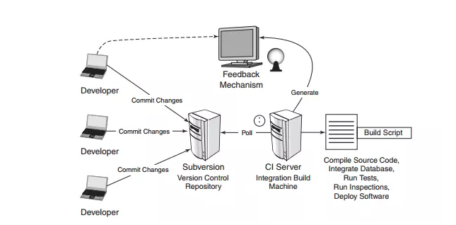

## CI (Continuous Integration)
- CI (Continuous Integration): Phương pháp triển khai phần mềm, tích hợp công việc của các thành viên trong team một cách tự động. Mỗi tích hợp được build, test nhằm giảm lỗi và dễ dàng rollback lại khi có lỗi xảy ra.
- Một kịch bản CI bắt đầu bằng việc depveloper commit code lên repo. Bất kì thay đổi nào sẽ trigger môt vòng đời CI. Các bước triển khai một vòng đời CI thường như sau:
    - Developer commit code lên repo
    - CI server giám sát repo và kiểm tra định kì thay đổi trên repo hay không (liên tục, chẳng hạn 1p một lần)
    - Ngay khi commit xảy ra, CI server phát hiện repo có thay đổi nên nó nhậ code mới nhất từ repo và sau đó build, chạy unit và test
    - CI server sẽ tạo các feedback và gửi để member của project
    - CI lại tiếp tục chờ thay đổi ở repo

## CD (Continuous Delivery)
- CD (Continuous Delivery): Mở rộng của CI, cho phép triển khai các thay đổi lên môi trường test hoặc staging. Continuous Delivery là cách triển khai thủ công lên môi trường test hoặc staging, nghĩa là khi nhận được trigger thay đổi thì noti cho team để triển khai thủ công.
- Continuous Delivery được thực hiện bằng cách sử dụng Deployment Pipeline

## CD (Continuous Deployment)
- CD (Continuous Deployment): tương tự như Continuous Delivery nhưng triển khai một cách tự động.
- Về cơ bản thì môi trường staging là môi trường giống với production nên đã làm Continuous Delivery được thì cũng làm Continuous Deployment được. Tuy nhiên thực tế thì ko dễ dàng vậy do ko thể đảm bảo mọi thứ trên staging giống hoàn toàn với production vì nó là 2 server riêng biệt. Vậy nên trong thực tế để triển khai lên production thì nên manual.
