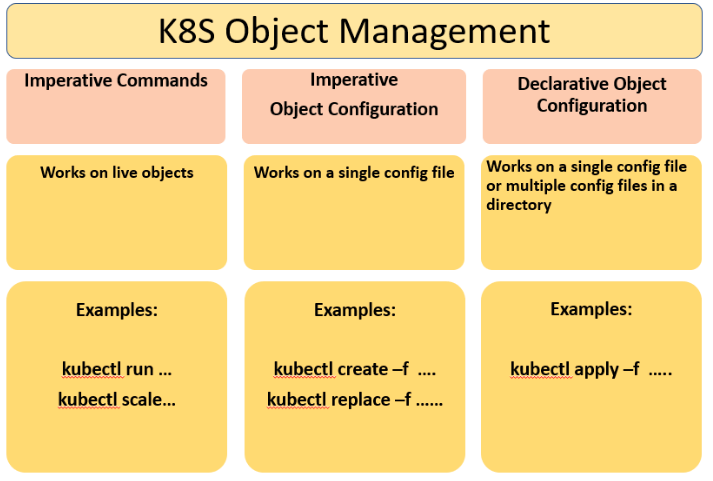
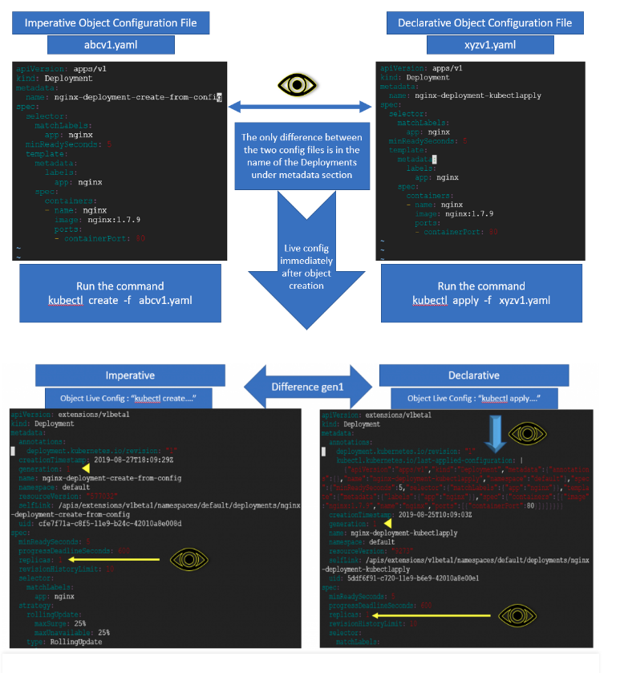
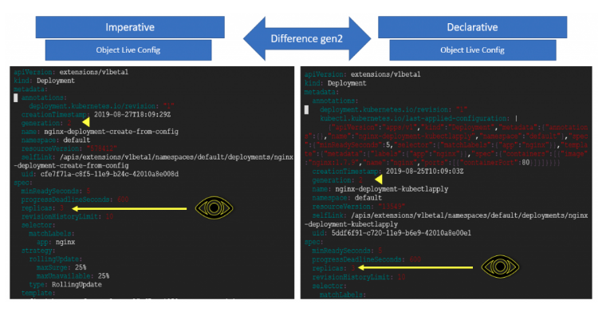
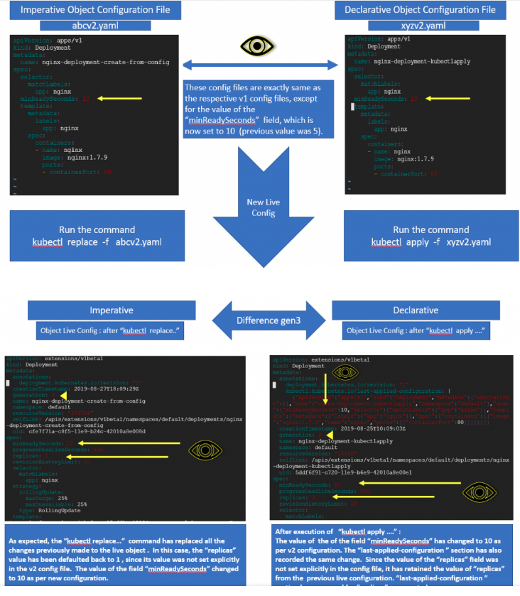

# kubectl create/replace vs kubectl apply
- Đều là 2 phương thức để quản lý các obj của K8s.
- Có 3 cách để quản lý obj của K8s như hình dưới

## Một số Khái niệm
- object configuration file/ configuration file: Là một file định nghĩa một K8s obj.
- live obj configuration / live configuration: Lưu các giá trị của một obj, thường được lưu ở etcd
- declarative configuration writer / declarative writer:

## Ví dụ
- Ví dụ sẽ làm rõ cách làm việc của Imperative và Declarative.
### Tạo 2 Deployment theo 2 phương thức và so sánh sự khác nhau.

- Như thấy live config sau khi tạo theo 2 phương thức.
- "last-applied-configuration" chỉ có trong live config khi tạo bằng Delerative mà ko có khi tạo obj bằng Imperative.
- "last-applied-configuration" ghi lại tất cả key/value mà đã định nghĩa ở file YAML (configuration file)
- Với các trường không được định nghĩa tại configuration file thì trong live config sẽ được cho các giá trị mặc định (vd: replicas=1).

### Run kubectl scale --replicas=3 ở cả 2 phương thức.

- Sau khi scale thì cả 2 live config đều có "replica=3"
- Trường "last-applied-configuration" không có gì thay đổi sau khi thực hiện lệnh "kubectl scale"

### Run "kubectl replace..." and "kubectl apply..."
- Sử dụng 2 file config mới và thực hiện như hình

- Với Declarative,sau khi apply thì replicas ko thay đổi (replicas=3)
- Với Imperative thì replicas=1