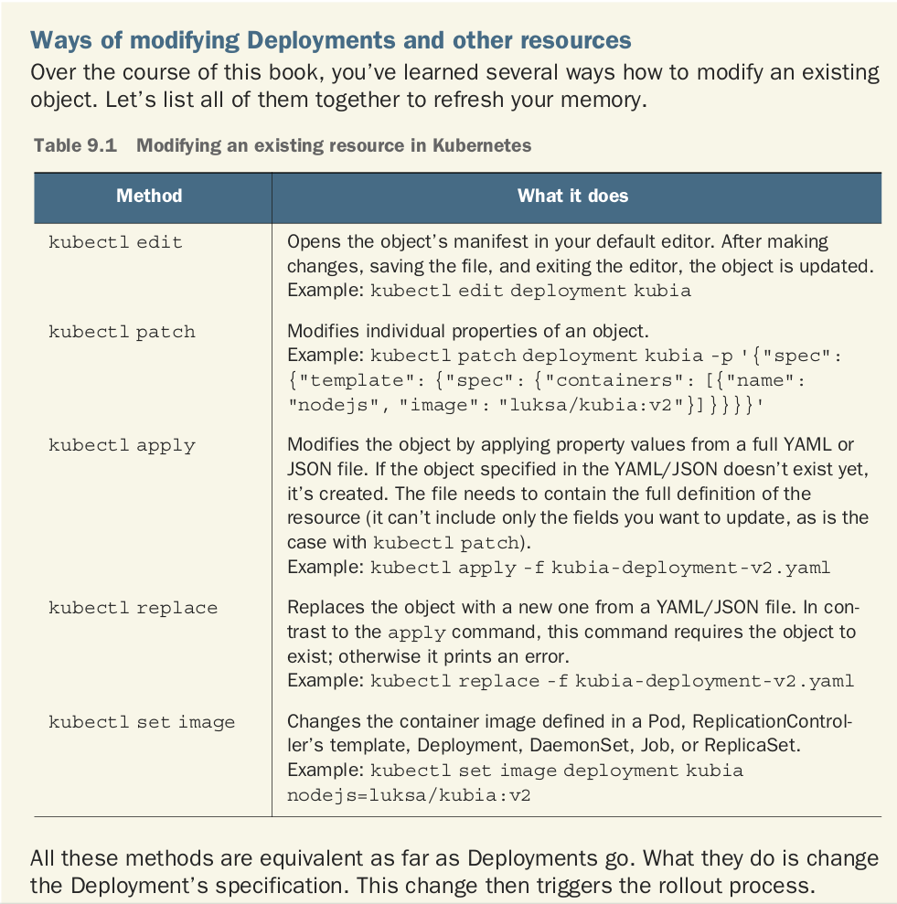

# List command of K8s
# Pod
## Run Pod:
```
kubectl run <name_pod> --image <image>
```
## Run Pod with container port
```
kubectl run <name_pod> --image <image> --port <port_number>
```
## Generate pod define output yaml
```
kubectl run <name_pod> --image <image> --dry-run=client -o yaml > <name_file>.yaml
```
## Change image for pod
```
kubectl set image pod/nginx nginx=nginx:1.15-alpine --record
```
## Create pod with command sleep
```
kubectl run busybox --image=busybox --command sleep 1000 --dry-run=client -o yaml > test.yaml
```
## Edit Pod running
```
kubectl edit pod <name_pod>
```
## Run Pod with label
```
kubectl run redis --image=redis:alpine --labels=tier=db
```
## Add label to pod
```
kubectl label pod <name_pod> <label>
ex:
kubectl label pod kubia-dmdck type=special
==> add lable "type=special"
```
## Change label of Pod
```
kubectl label pod <name_pod> <new_label> --overwrite
ex:
kubectl label pod nginx app=nginx-01 --overwrite
==> change label from "app=nginx" to "app=nginx-01"
```
## List Pod with all label
```
kubectl get pods --show-labels
```
## List Pod with special label
```
kubectl get pods -L <label_name>
ex:
kubectl get pods -L app
==> list all pod with label "app"
```
# Replication Controller
## Delete RC but not delete Pod
```
kubectl delete rc <name_rc> --cascade=false
```
## Scale up RC
```
kubectl scale rc <name_rc> --replicas=<number>
```
## Update version app use RC
```
kubectl rolling-update <name_rc_old> <name_rc_new> --image=<new_image>
```
# ReplicaSet
## Create RS with file yml
```
kubectl create -f replicaset-def.yml
```
## Delete RS
```
kubectl delete replicaset <name_rs>
```
## Replace RS
```
kubectl replace -f replicaset-def.yml
```
# Deployment
## Create deployment use kubectl
```
kubectl create deployment <name_deployment> --image=<image>
kubectl scale deployment <name_deployment> --replicas=<number>
```
## Modify single prolerty
```
kubectl patch deployment <name_deployment> -p '{"spec": {"minReadySeconds": 10}}'
```
## Update new image
```
kubectl set image deployment <name_deployment> <name_container>=<new_image>
```

## Follow the process of the rollout
```
kubectl rollout status deployment <name_deployment>
```
## Undo rollout (rollback)
```
kubectl rollout undo deployment <name_deployment> --to-revision=<revision>
default revision is newest
```
## Display rollout history
```
kubectl rollout history deployment <name_deployment>
```
## Expose deployment
```
kubectl expose deployment hr-web-app --name hr-web-app-service --type=NodePort --port 8080 --target-port 8080 --dry-run=client -o yaml > hr-web-app-service.yaml
```
# Namespace
Get Namespace with no header
```
kubectl get ns --no-headers
```
Get number of namespace
```
kubectl get ns --no-header | wc -l
```
# Service
## Create service
```
kubectl expose pod redis --name redis-service --port 6379 --target-port 6379 
```

ref: https://kubernetes.io/docs/reference/generated/kubectl/kubectl-commands#-strong-getting-started-strong-
## StorageClass
StorageClass contains fields: *provisioner*, *parameters*, and *reclaimPolicy*

## linux get number connection to port
```
netstat -anp | grep 80 | wc -l
```
## Get range ip configured for service
```
cat /etc/kubernetes/manifests/kube-apiserver.yaml | grep cluster-ip-range
```
## Get range ip address configured for pod
```
kubectl logs <weave-pod-name> weave -n kube-system
```
## List all pods show name and namepace with json path
```
kubectl get pods -o=jsonpath="{.items[*]['metadata.name', 'metadata.namespace']}"
```
## lookup DNS
```
# kubectl run test-nslookup --image=busybox:1.28 --rm -it --restart=Never -- nslookup nginx-resolver-service
# kubectl run test-nslookup --image=busybox:1.28 --rm -it --restart=Never -- nslookup <P-O-D-I-P.default.pod> > /root/CKA/nginx.pod
```